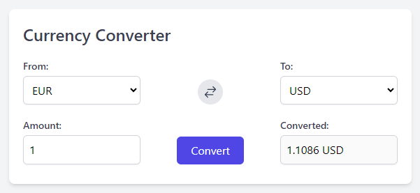

<h1 align="center">
  <br>Simple Currency Converter<br>
</h1>

<p align="center">
  
</p>

## How To Use

You can view the project by clicking this [link](https://react-currency-converter-theta-flame.vercel.app/)

You can download the repository or clone it via [Git](https://git-scm.com/downloads)
```bash
# Clone the repository
$ git clone https://github.com/mertozturksh/react-currency-converter.git

# Go into the repository
$ cd currency-converter

# Install dependencies
$ npm install

# Run the app
$ npm run dev
```